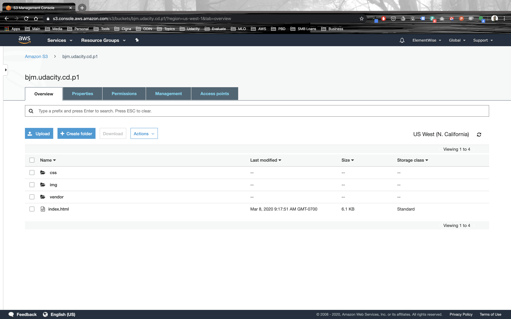
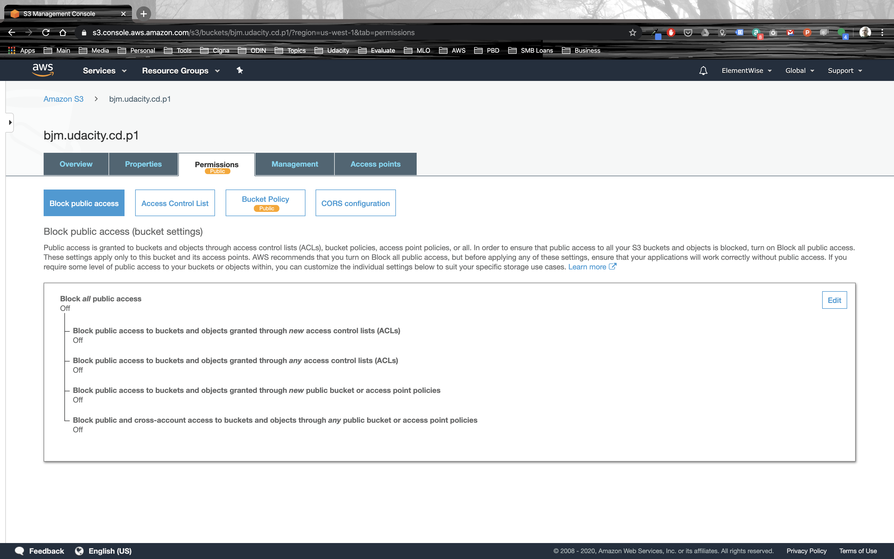

# Udacity: Cloud Developer Nanodegree
**Section 2: Cloud Fundamentals, Project 1: Deploy Static Website on AWS**

In this project, I deployed a static website to AWS. The following is a link to the website:

[Udacity’s School of Cloud Computing Travel Blog](https://d33qhdmihrtw8x.cloudfront.net/index.html)

*Please Note: This site may be disabled to minimize AWS costs.*

The following are the steps I took to complete the project.

## Step 1
The following screenshot shows that the S3 bucket has been created and the website files have been uploaded.

## Step 2
The following screenshot shows that the S3 bucket is public.

## Step 3
The following screenshot shows that the S3 bucket policy has been implemented.

![Step 3][Step3.png]

## Step 4
The following screenshot shows that the Cloudfront Distribution has been created.

![Step 4][Step4.png]

## Step 5
The following screenshot shows that the website displays correctly in the browser.

![Step 5][Step5.png]

